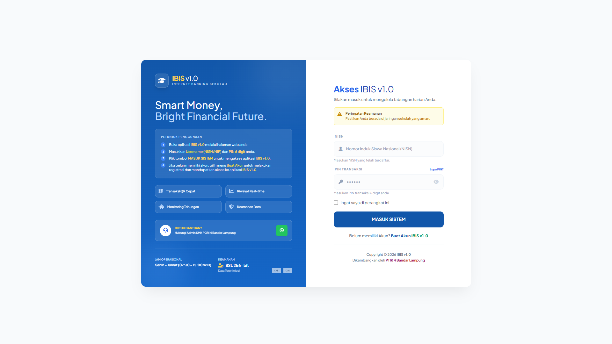
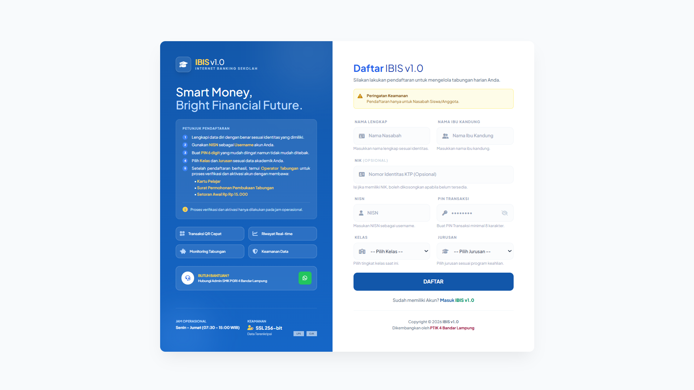
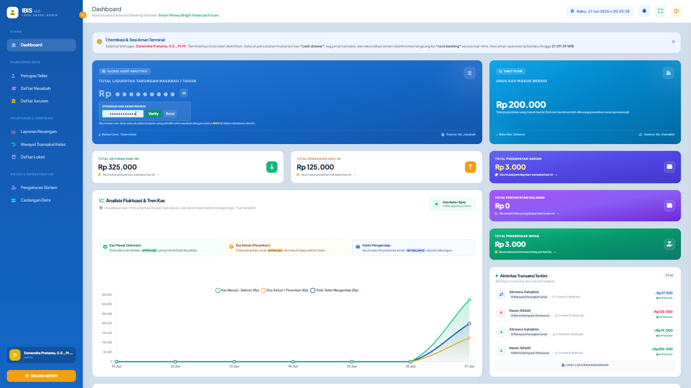
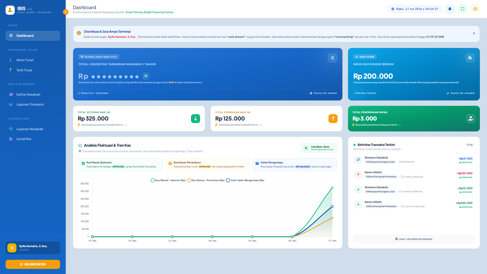
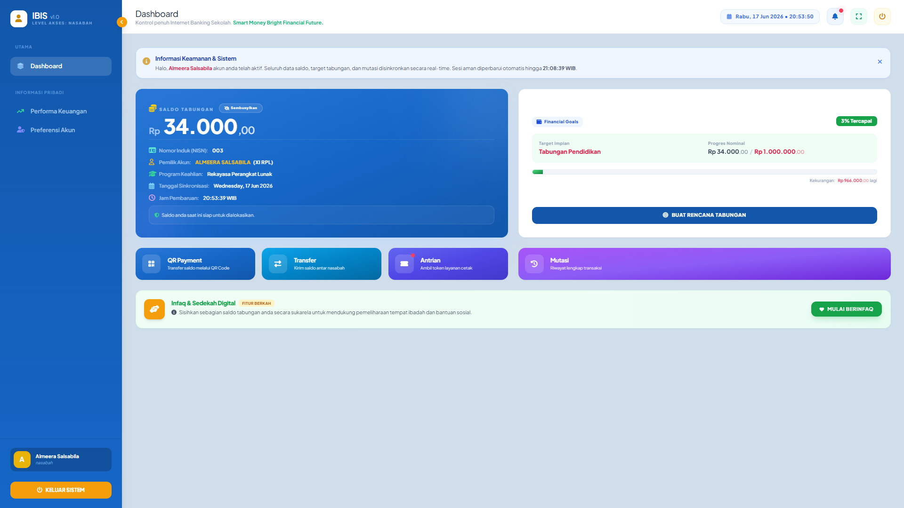

# 🏦 IBIS v1.0 - Institutional Banking Information System
> **Sistem Core Banking Digital Skala Instansi Pendidikan (Versi 1.0)**

**IBIS v1.0** adalah platform *core banking* berbasis web yang dirancang khusus untuk memodernisasi, mengotomatisasi, dan mengamankan tata kelola administrasi keuangan serta tabungan siswa di lingkungan institusi pendidikan secara tersentralisasi, akuntabel, dan transparan.

---

## 📸 Antarmuka Sistem (System Interface)

Visualisasi fungsionalitas dan rancangan antarmuka komponen sistem **IBIS v1.0**:

### 🔐 Lapisan Otentikasi & Registrasi Mandiri
<table border="0">
  <tr>
    <td align="center" width="50%">
      <h4>Halaman Gateway Login</h4>
       
      <em>Gerbang otentikasi terenkripsi untuk Admin, Operator, dan Nasabah</em>
    </td>
    <td align="center" width="50%">
      <h4>Halaman Registrasi Nasabah</h4>
       
      <em>Fasilitas standardisasi pendaftaran mandiri bagi entitas nasabah baru</em>
    </td>
  </tr>
</table>

### 💻 Panel Kendali Konsol Eksekutif & Operasional

  <h4>Dashboard Administrator Utama</h4>
  
  
<em>Pusat komando sistem: Monitoring likuiditas kas, analisis statistik perputaran uang, dan manajemen hak akses user</em>

<table border="0">
  <tr>
    <td align="center" width="50%">
      <h4>Dashboard Petugas (Operator/Teller)</h4>
       
      <em>Konsol kerja operasional harian untuk eksekusi mutasi keuangan dan manajemen kelas</em>
    </td>
    <td align="center" width="50%">
      <h4>Dashboard Buku Tabungan Nasabah (Siswa)</h4>
       
      <em>Akses transparansi informasi: Pemantauan saldo, riwayat mutasi rekening, dan grafik tren simpanan</em>
    </td>
  </tr>
</table>

---

## 🚀 Fitur Unggulan Sistem
* **Role-Based Access Control (RBAC)**: Pengamanan hak akses ketat yang terbagi ke dalam 3 hierarki pengguna (Admin, Petugas, Nasabah) guna mencegah tumpang tindih otoritas.
* **Real-Time Transaction Ledger**: Sistem otomatisasi kalkulasi pembukuan langsung untuk setiap transaksi setoran, penarikan, dan perpindahan dana tanpa tundaan (*zero-lag*).
* **Automated Document Generator**: Fasilitas ekspor data laporan komprehensif ke format cetak dokumen legal PDF (via FPDF) dan tabulasi data Excel secara otomatis.
* **SMTP Automated Notification Gateway**: Pengiriman resi, struk bukti transaksi digital, serta notifikasi aktivitas akun secara instan menuju kotak masuk email target pengguna (via PHPMailer).
* **High-Level Data Protection & Security**: Enkripsi mutakhir untuk kata sandi, proteksi berkas konfigurasi sensitif via variabel lingkungan (`.env`), serta isolasi penanganan kegagalan transaksi.

---

## 👥 Matriks Hak Akses & Pembagian Otoritas

### 1. Administrator (Super User / Eksekutif)
* **Full-System Control**: Memiliki otoritas tertinggi untuk memanipulasi seluruh data master dan manajemen siklus hidup pengguna (CRUD data Admin dan Operator).
* **Sistem Pemeliharaan & Audit**: Menangani pemulihan data (*backup & restore* database), manajemen pengaturan ulang (*reset*) akun massal, serta inspeksi menyeluruh terhadap log aktivitas sistem.
* **Kebijakan Finansial**: Mengonfigurasi parameter sistem, limitasi nilai transaksi harian, regulasi biaya administrasi, dan melakukan pengawasan makro terhadap total likuiditas kas.

### 2. Petugas (Operator / Teller Bank)
* **Manajemen Operasional**: Bertanggung jawab penuh atas pengelolaan data nasabah (siswa) serta struktur penempatan kelas/jurusan.
* **Eksekutor Kliring Tunai**: Memproses entri transaksi setoran kas, penarikan tunai, validasi nomor referensi perbankan, dan pencetakan struk fisik transaksi.
* **Analisis Harian**: Memantau pergerakan kas harian pada loket terkait, melakukan filtrasi jurnal, dan mengekspor laporan kerja periodik.

### 3. Nasabah (Siswa / Anggota)
* **Self-Service Monitoring**: Akses mandiri untuk meninjau ketersediaan saldo efektif, melacak riwayat mutasi rekening koran pribadi, dan memantau status target tabungan berencana.
* **Analisis Portofolio**: Visualisasi grafik interaktif mengenai pertumbuhan dan akumulasi dana tabungan secara periodik.
* **Unduh Resi Mandiri**: Hak mengunduh salinan struk bukti transaksi digital kapan saja sebagai bukti otentik pertukaran dana.
* **Security Management**: Fitur pembaruan kata sandi mandiri secara berkala dan konfigurasi preferensi notifikasi keamanan.

---

## ⚙️ Sistem Konfigurasi Dinamis (Dynamic Application Management)

Aplikasi **IBIS v1.0** mengimplementasikan arsitektur CMS Mini di sisi Administrator, memungkinkan kustomisasi identitas aplikasi secara dinamis tanpa intervensi baris kode:

| Parameter Konfigurasi | Titik Penempatan | Implikasi & Fungsi |
| :--- | :--- | :--- |
| **Nama Aplikasi Utama** | Browser Title Bar | Mengontrol penamaan atau penjenamaan (*branding*) utama sistem pada tab peramban. |
| **Versi Engine** | Footer & System Info | Identifikasi pelacakan versi rilis sistem untuk mempermudah manajemen pemeliharaan (*version tracking*). |
| **Subjudul Sistem** | Halaman Autentikasi | Informasi pelengkap yang memuat deskripsi layanan tepat di bawah judul halaman login. |
| **Tagline Banner 1** | Welcome Banner | Teks pengumuman strategis atau pesan motivasi baris pertama pada halaman utama dashboard. |
| **Tagline Banner 2** | Welcome Banner | Teks regulasi pelengkap atau pesan informatif baris kedua pada welcome banner dashboard. |
| **Hak Cipta (Developed By)** | Footer Konten | Deklarasi hak kepemilikan dan hak cipta pengembang yang disematkan secara global di kaki halaman web. |

---

## 🗄️ Arsitektur & Logika Basis Data (Database Lifecycle)

Sistem ini didukung oleh basis data relasional **MySQL** (`mibank_db`) dengan arsitektur yang dirancang untuk menjamin integritas data (*data integrity*) dan kepatuhan audit keuangan:

1. **Isolasi Entitas Akun**: Pemisahan tegas antara tabel manajemen internal (`tbl_users`) dan tabel eksternal (`tbl_nasabah`) guna meminimalisasi risiko eksploitasi hak akses lintas sektor.
2. **Double-Entry Transaction System**: Setiap operasi manipulasi finansial pada `tbl_transaksi` (Setor, Tarik, Pindah Buku/Transfer) secara simultan akan melakukan pembaruan (*update*) saldo efektif pada `tbl_nasabah` dan menerbitkan pencatatan sejarah kronologis pada `tbl_mutasi` (mekanisme Debit/Kredit).
3. **Mekanisme Jurnal Kas (Teller Control)**: Mengadopsi standar akuntansi dengan kewajiban pembukaan dan penutupan buku laci harian (`tbl_jurnal_kas`). Operator tidak dapat melakukan input transaksi apabila status loket kerja belum diaktifkan (`open`).
4. **Strict Audit Trail (Log Activity)**: Penegakan aspek akuntabilitas lewat perekaman aktivitas pengguna secara mendalam pada `log_activity`. Sistem melacak data pelaku, bentuk aktivitas, stempel waktu, `ip_address`, hingga identitas perangkat (`user_agent`) untuk kebutuhan forensik keamanan.

---

## 🛠️ Spesifikasi Teknologi (Tech Stack)
* **Bahasa Pemrograman Utama**: PHP Native (Rekomendasi Versi: `>= 8.3`)
* **Sistem Manajemen Database**: MySQL (Engine Storage: InnoDB dengan dukungan *Foreign Key Constraints*)
* **Dependensi Pustaka (Composer Packages)**:
    * `setasign/fpdf`: Pustaka utama pembuat komponen cetak dokumen laporan berformat PDF.
    * `phpmailer/phpmailer`: Mesin pengelola lalu lintas pengiriman notifikasi via protokol SMTP Mail.
    * `vlucas/phpdotenv`: Lapisan enkapsulasi penanganan variabel lingkungan sensitif melalui berkas `.env`.
    * `nesbot/carbon`: API ekstensi manipulasi penanggalan, waktu, serta pelokalan zona waktu secara presisi.